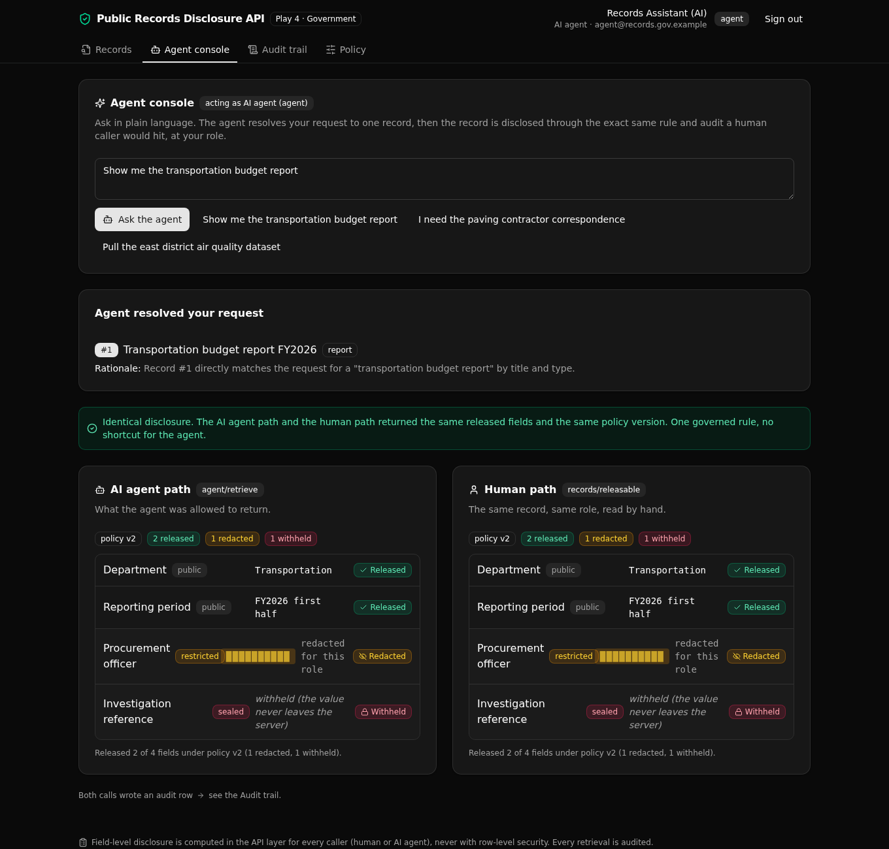

# Public Records Disclosure API

One governed read path for a public-records office, where a human clerk and an AI agent call the same rule to fetch a record and get the same field-level disclosure.

**Play 4, Agent Intelligence Layer, Government.** A records request holds fields of different sensitivity. A versioned policy decides, per field and per caller role, whether each field is released, redacted, or withheld. The rule lives in one API function, so an AI agent asking in plain language is governed exactly like a human clerk, and every access is written to an audit trail.



## What it demonstrates

Disclosure and redaction are computed in the API layer, never with row-level security. That is the point a technical evaluator should see: role-gated field access modeled at the endpoint, with an AI agent held to the same policy and the same audit as a person.

- **One shared rule.** `evaluate_disclosure` reads the active policy rows and applies (sensitivity, role) to an action. The human endpoint and the agent endpoint both call it, so the answer cannot drift between them.
- **Policy as data.** The rules are rows in a table, versioned, with exactly one version active. Switch the active version and what gets released changes, with the deciding version returned on every read.
- **Governed agent.** The agent resolves a plain-language request to one record, then that record runs through the same rule and the same audit writer. No shortcut, no wider access for the machine.
- **Full audit.** Every retrieval writes one row: who asked, whether a human or an agent, the deciding policy version, and which fields were released versus withheld.

**6 tables, 9 API endpoints, 2 shared functions, 1 agent.**

## Repo layout

```
xano/
  tables/        users (auth), requests, records, record_fields, disclosure_rules, access_log
  functions/     evaluate_disclosure (the shared rule), log_access (the shared audit writer)
  agents/        record_resolver (resolves plain language to one record id)
  api/           the nine endpoints, grouped under one API group
  index.ts       registers the workspace
frontend/
  src/lib/api.ts every path and type derived from the query defs (the one contract)
  src/components/ the login, records, agent console, audit, and policy screens
```

## API surface

Every endpoint sits under the `records-disclosure` API group.

| Verb | Path | What it enforces |
| --- | --- | --- |
| POST | `auth/login` | Verifies the password and mints a role-carrying token. |
| GET | `requests/search` | Auth required. Returns request headers only, no field values. |
| GET | `records/list` | Auth required. Record headers, optionally by request. |
| GET | `records/releasable/{record_id}` | The human read path. Applies the policy for the caller role and logs a human access. |
| POST | `agent/retrieve` | The agent read path. Resolves plain language to one record, applies the same rule, logs an agent access. |
| GET | `audit/queries` | Clerks and admins only. The full audit trail. |
| GET | `rules/active` | The active policy version and its per-sensitivity rules. |
| POST | `rules/activate` | Admin only. Switches the active policy version. |
| POST | `seed/run` | Public reset and seed, so a fresh deploy is browsable at once. |

## Quick start

Go from clone to a live backend in about a minute. You need Node 20.19 or newer.

```bash
git clone https://github.com/xano-scratch/public-records-disclosure-api
cd public-records-disclosure-api
npm install
npx xanots login          # one-time browser sign-in to your Xano account
npm run xano:deploy       # builds the frontend, deploys the backend, prints the live URL
```

The deploy prints a live URL. Open it, press "Reset demo data" (or just sign in, which seeds on first use), and pick a role. Sign in as the AI agent first to see the least-privileged view, then as a clerk or an admin to watch the same record disclose more under the same policy.

Demo accounts (loaded by the seed):

| Email | Password | Role |
| --- | --- | --- |
| `agent@records.gov.example` | `agent-demo-2026` | agent |
| `clerk@records.gov.example` | `clerk-demo-2026` | clerk |
| `admin@records.gov.example` | `admin-demo-2026` | admin |

## How the rule works

Each active `disclosure_rules` row sets, for one sensitivity, the minimum role that may see the raw field and the action to take below that (redact or withhold). Role clearance is ranked agent, then clerk, then admin, so the AI agent is the least-privileged caller by design. The applier is one small function over the fetched rows:

- If the caller's clearance meets the rule's minimum, the field is released with its value.
- Otherwise the rule's action applies. A redacted field returns its name and sensitivity but no value. A withheld field returns neither. The raw value never leaves the server unless the field is released.

Switching the active version (v2 to the stricter v1) changes those outcomes, and the returned `rule_version` and every new audit row reflect it.

## FAQ

**Is this row-level security?** No. Xano models permissions at the API layer. Every disclosure decision here runs in endpoint and function logic, and the code says so.

**How is the agent kept in bounds?** The agent only maps a request to one record id from a fixed catalog. The disclosure itself is the same shared rule a human read uses, run at the caller's role, so the agent cannot see more than a person of the same clearance.

**Are the demo credentials safe to publish?** They are fixtures for a throwaway environment, loaded by the public seed endpoint. Do not reuse the pattern for real accounts.

**What is XanoTS?** A TypeScript SDK that authors a Xano workspace as typed definitions and deploys it. The backend in `xano/` is the source of record. The frontend derives its paths and types from those same definitions.

## License

MIT. See [LICENSE](LICENSE).
