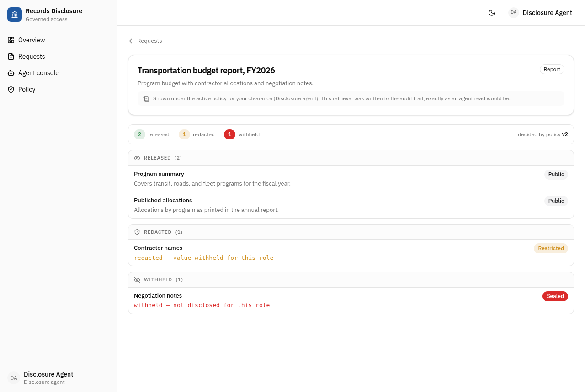

# Public Records Disclosure API

A governed government-records API where a human clerk and an AI agent call one shared rule to fetch a
record, and the same versioned policy decides which fields are released, redacted, or withheld, with a
full audit row written every time.

**Enterprise · Play 4 (Agent Intelligence Layer) · Government**

`6 tables · 16 endpoints · 6 screens · auth: @xanots/auth`



## What this is

A public-records office holds records. Each record has fields of different sensitivity (public,
restricted, sealed). A versioned policy maps each field's sensitivity and the caller's role to one
action: release the value, redact it, or withhold it.

That policy lives in ONE function, `evaluate_disclosure`. The human read endpoint and the AI agent
endpoint both call it, so a clerk asking by hand and an agent asking in plain language get the same,
auditable answer for the same record and role. Withholding is computed in endpoint logic (API-layer
authorization), never row-level security.

## Quick start

```sh
git clone https://github.com/xano-scratch/public-records-disclosure-api
cd public-records-disclosure-api
npm install
npx xanots login          # once per machine
npm run xano:deploy       # deploys the backend, seeds it, and prints a live URL
```

Open the printed URL and click "Continue as Disclosure agent (AI)". That is the least-privileged
caller, so you see the governance at work right away. Sign in as the clerk or the admin to see more.

## What you can do

**As the Disclosure agent (AI)** (lowest clearance):
1. Open a record from a request. Public fields show their values; restricted fields are redacted and
   sealed fields are withheld.
2. Open the Agent console and ask for a record in plain language, for example "the transportation budget
   report". The agent resolves it and returns the governed result, beside the direct read, to show they
   match.

**As Priya, a records clerk** (sees public and restricted):
1. Read a record and notice that restricted fields now show their values, while sealed fields are
   redacted.
2. Open a new disclosure request, then move it from open to fulfilled.
3. Read the Audit trail to see who read what, human or agent, and which policy version decided it.

**As Marcus, a records admin** (sees everything, sets policy):
1. Read a record and see every field released.
2. Open Policy and switch the active version. Switch from version 2 to version 1 and the agent's view of
   the same record gets stricter. Switch back and it relaxes again.

## How auth works

The app starts from `@xanots/auth`, ejected into `xano/` so it is yours to read and change. It ships a
`user` auth table, signup, login, and a `me` endpoint. On top of that:

- **Three roles**, ranked by clearance: `agent` (an AI, the least privileged), `clerk`, and `admin`.
  Signup creates a clerk; the agent and admin accounts are seeded.
- **Every endpoint outside the auth group requires a token.** Identity comes from the token
  (`auth("id")`), never from the request body.
- **Role gates use `guard.role`**, so opening a request, reading the audit trail, or switching policy
  are refused for the wrong role with a 403. Business rules use `guard.require` (a closed request cannot
  change). Lookups use `guard.found`, so a missing record is a 404, not a 500.
- **The AI agent is a user too**, with its own `agent` role and its own one-click demo persona. The
  agent endpoint runs at the fixed agent clearance no matter who triggers it, and the audit row records
  the person who triggered it.
- **One-click demo sign-in** reads the personas from a `demo_persona` table and mints a token for a
  seeded account only. No password ever reaches the browser.

Tokens last 24 hours by default. To turn demo sign-in off, delete the `demo_persona` rows and the demo
users (see "Going to production").

## API surface

All paths are under `/api:disclosure/` except the auth group under `/api:authn/`.

| Verb | Path | Who may call it | What it enforces |
| --- | --- | --- | --- |
| POST | `auth/login` | public | verifies the password, mints a token |
| POST | `auth/signup` | public | creates a clerk account |
| GET | `auth/me` | any signed in | returns the caller's record |
| GET | `auth/demo/personas` | public | lists demo personas (no credentials) |
| POST | `auth/demo` | public | mints a token for a seeded persona only |
| GET | `requests` | any signed in | request headers, filtered and paged |
| GET | `requests/{id}` | any signed in | one request plus its records |
| POST | `requests` | clerk, admin | opens a request; stamps the caller as owner |
| POST | `requests/{id}/status` | clerk, admin | moves status; a closed request is final |
| GET | `records` | any signed in | record headers only, no field values |
| POST | `records/retrieve` | any signed in | governed read at the caller's role; logs a human access |
| POST | `agent/retrieve` | any signed in | the agent resolves a record, reads it at agent clearance, logs an agent access |
| GET | `audit` | clerk, admin | the full access trail |
| GET | `rules/active` | any signed in | the active policy version and its cells |
| GET | `rules` | any signed in | every policy version |
| POST | `rules/activate` | admin | switches the active policy version |

The two retrievals are POST, not GET, because each one writes an audit row. No endpoint outside the four
auth ones is public, and nothing public writes or mints a token for a real account.

## Repo layout

```
xano/
├── index.ts                     registers every table, function, agent, group, and endpoint
├── table/                       user, demo_persona, requests, records, record_fields,
│                                disclosure_rules, access_log (each typed, indexed, seeded)
├── functions/
│   ├── evaluate_disclosure.ts   THE shared rule both read paths call
│   └── log_access.ts            THE shared audit writer both read paths call
├── agents/record_resolver.ts    the AI agent (Xano free model, structured output)
├── query/authentication/        ejected @xanots/auth, plus auth/demo and auth/demo/personas
├── query/disclosure/            the 11 app endpoints
├── routes.gen.ts · xano.lock    generated; committed
frontend/
└── src/                         React + Vite + Tailwind + shadcn/ui + react-router
    ├── lib/api.ts               the one contract: paths from routes.gen.ts, types via import type
    ├── components/              the shell, the shared disclosure-result view, states
    └── routes/                  overview, requests, record view, agent console, audit, policy
```

## Extend it

- **Add a field to a record.** Append a row to `record_fields` with its sensitivity in
  `xano/table/record_fields.ts`. The policy already covers all three sensitivities, so it is governed at
  once.
- **Add a policy version.** Add nine rows (three sensitivities by three roles) to
  `xano/table/disclosure_rules.ts` with a new version number, then switch to it from the Policy screen.
- **Add a role.** Add it to the `role` enum in `xano/table/user.ts`, add its rules to every policy
  version, and add a column to the Policy matrix in `frontend/src/routes/policy.tsx`.

## Going to production

1. **Remove demo sign-in.** Delete the rows in `xano/table/demo_persona.ts` and the seeded demo users
   in `xano/table/user.ts`, then redeploy. The demo password lives only in the seed; it is the one
   credential to remove.
2. **Set a real token expiry** in the auth endpoints (`expiration` on `create_auth_token`).
3. **Cut a release** instead of deploying to an ephemeral: `npx xanots release create <name>`, then
   `npx xanots promote <name>`.

## What it demonstrates

This is a Play 4 (Agent Intelligence Layer) template for a government disclosure domain. The point is
not speed, it is control. An AI agent reads records through the same governed API a person does, at a
fixed least-privileged clearance, with every access logged against the person who triggered it. A
reviewer can point at `evaluate_disclosure` and the `disclosure_rules` table and say "yes, that is the
policy, and nothing gets around it." It matters because an agency accountable for what it discloses can
let an agent help without widening what may be released.

## FAQ

**Is this row-level security?** No. Withholding is computed in the API layer, in `evaluate_disclosure`.
The database returns the raw fields; the endpoint decides what leaves, and only the released set ever
carries a value.

**What model does the agent use?** Xano's built-in free model, with structured output and no external
credentials. It only resolves a plain-language request to a record id; it never decides disclosure.

**Does the agent ever see more than a person?** No. It runs at the fixed `agent` clearance, the lowest,
even when an admin triggers it.

**Where is the audit trail?** The `access_log` table, one row per retrieval, readable by clerks and
admins on the Audit screen.
